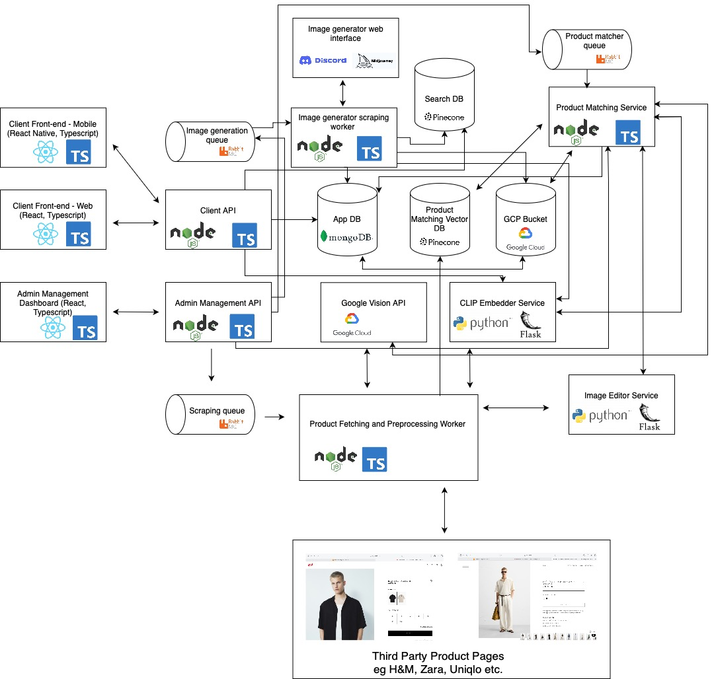

# Dripday Light

**Dripday Light** is a partial implementation of Dripday's architectural design. This repository includes the following core components:

- 🌐 **Web Frontend**  
  A user-facing mobile interface for interacting with the platform.

- ⚙️ **Backend API**  
  Provides RESTful endpoints for the frontend and other services.

- 🧠 **Vector Embedding Service**  
  Handles vectorization for data embedding and semantic operations.

- 📦 **Model Library**  
  Contains the core machine learning model logic used by the embedding service.

## Overview

This project serves as a simplified and modular version of the full Dripday architecture. The main purpose is to showcase parts of the system that I've built.

## Technologies Used

- **Frontend**: TypeScript, React Native  
- **Backend**: TypeScript, Node.js, Express  
- **Embedding Service**: Python, Flask, OpenAI CLIP model

## Architecture

The diagram below illustrates the overall architecture of the Dripday system. This repository implements key components, including the **Client Frontend Web**, **Client API**, and the **CLIP Embedder**.

